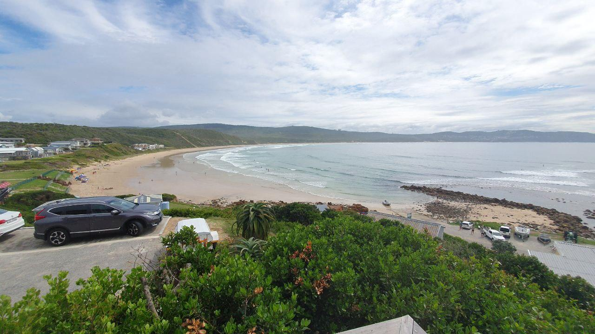
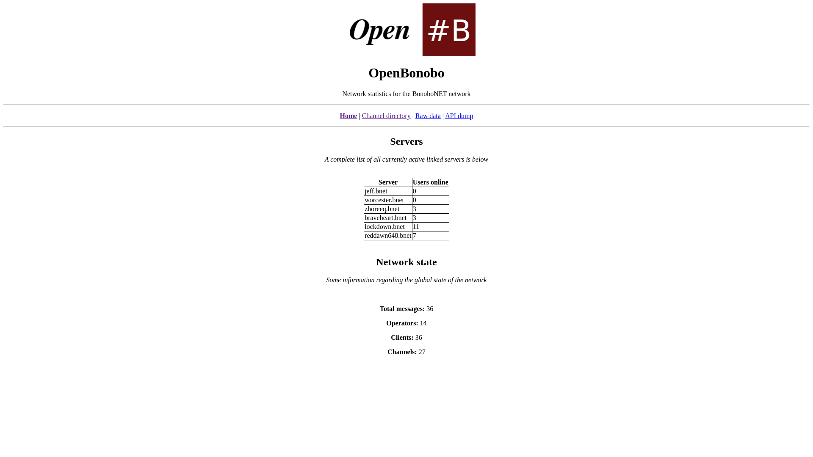

OpenBNET
========

**OpenBNET** or _OpenBonoboNET_ is a small lightweight Flask-based web app for displaying information about your `unrealircd`-based IRC network.

It's a small project I, `deavmi`, started working on during my beach holiday 🌊️ at _Buffalo Bay, Western Cape_ as, from what my minimal research showed,
there was no existing software out there that actually made use of the `third/wwwstats` module that you could find on the unrealircd module repository. In case you are wondering, the `wwwstats` module simply provides a UNIX domain socket with, a rather bad interface, no header for size to expect, so I just read 4096 bytes at max and then get the _actual bytes read_ from it, but the implementation can be found on the [OpenBNET source repository](https://github.com/bonobonet/OpenBNET).

OpenBNET provides you the following informative pages as you will see below. I would like to thank `rany` (see his [GitHub](https://github.com/rany2/)) for helping make it very stable, tne addition of caching (as to not abuse system calls or the unrealircd daemon itself (possibly mutex wise)), defensive programming strategies added and also quality features such as the environment variable handling.

## Pages offered

### General state information

The homepage at `/` will provide you information regarding the currently active servers (those linked in) along with their current user count. It also provides you with information on how many people are currently oppe'd (how many operators/opers are online), total messages passed through _this_ server (i.e. sent from it, I believe) and a few other pieces of information you shall see below.

### Channel directory

A web frontend for your IRC network obviously wouldn't be complete without a directory of all existing channels, so we have one! This is accessed at `/channels`.

### Raw dump

There is also a "raw" dump available at `/raw`:

### API

There is a plaintext _actually_ raw dump available at `/api`, if anyone ever wants to reuse our work without having to add UNIX domain stuff into their backend and implemented what is effectively a UNIX domain socket to HTTP socket (TCP) forwarder (in the API realm of things).

## Setup

Information on _how_ to setup OpenBNET can be found [here](../../openbnet).
